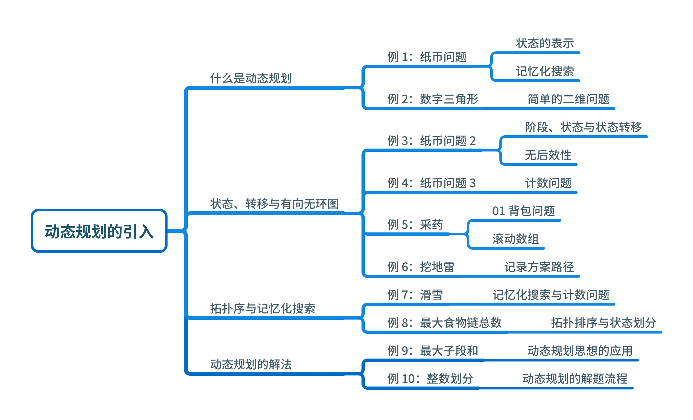

# Copied from Luogu

我们接触过很多“求最佳方案”的题目了。遇到这种问题，可以考虑使用贪心算法在每步决策时使用单步最佳方案，或者使用枚举（搜索）算法枚举所有可能的决策。使用贪心算法的问题是“目光短浅”，不一定可以站在全局的角度来统筹决策，可能会出现结果并不是全局最佳的；而使用枚举搜索算法，虽然可以遍历所有的可能，但如果数据量稍大，就可能超时。这个时候可以考虑使用动态规划解决这些问题。

动态规划的核心是“状态缓存”，将一个状态的统计结果传递到另外一个状态，这有一点类似递推算法。动态规划是算法竞赛的常客，非常考验选手问题分析和代码实现能力，因此值得我们在本书中专门开辟一个部分来介绍。

附：[原网址](https://www.luogu.com.cn/training/211#information)

