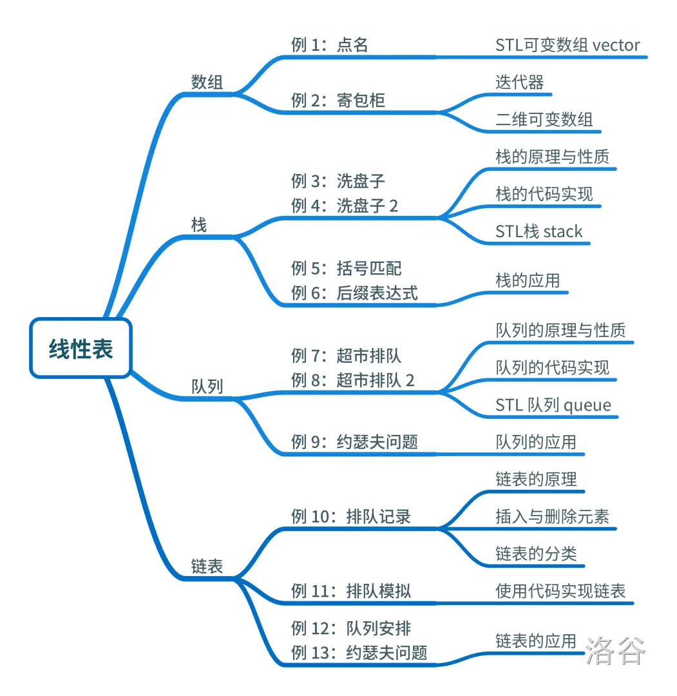

# 题单简介
我们之前已经研究过很多算法了！比如，二分法可以用来“给定单调函数，求零点”；冒泡排序可以用来“给定一个数组，将其排序后输出”……你已经知道算法很有用，接下来要学习的数据结构，也一样很有用！初学数据结构，您可能会觉得无从下手；不过不用担心，本书会用很多生活中实际存在的例子来解释这些数据结构。

比如，在商场里面排队结账，或者在网上“秒杀”商品，差别很大；但它们都遵循着相同的规则——讲“先来后到”。早来的，就早买到商品；晚来的，就晚买到商品，甚至可能买不到商品。可以利用“先来后到”这一规则，把这两种排队模式统一起来——它们都是“队列”，都可以用队列这一数据结构来模拟。然后建模，编写计算机程序解决这些问题。

这一章，先开始学习线性表。线性表是最简单、最基本的一种数据结构，一个线性表示多个具有相同类型数据“串在一起”，每个元素有前驱（前一个元素）后继（后一个元素）。根据不同的特性，线性表也分为栈、队列、链表等等。因为这些特性，数据结构可以解决不同种类的问题。

附：[原网址](https://www.luogu.com.cn/training/113#information)
